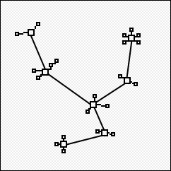
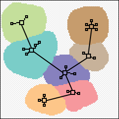

# SuperGen Planning:

This problem can be broken down into a few main things:

- Generating worlds
    - generating layers
    - combining layers
    - checking validity of layers

After everything is generated, a `WorldSegment` object is made.
The WorldSegment contains information that will allow us to
generate entities.

------------------

How about we have 2 types of "layers" in SuperGen:
- uniform layers (all integer x,y positions have a value)
- discrete layers (a list of nodes; i.e list of rooms)

For example, we may have a discrete layer, with a list of cities.
From there, our cities could cause landmasses to generate.

(I.e. the RED city would generate RED terrain upon the continuous layer)

--------------------

## Example below:
In this example, a discrete layer is generated, and then a continuos layer is generated.

The discrete layer augments the continuous layer:

Images from: http://www.squidi.net/three/entry.php?id=54

-----------

# Ideas for future:

- Spawn entities
- Serialize/save world generation state:
    Save the world-generation state (i.e. able to resume generation at later date)
    Save the SGCtx object

